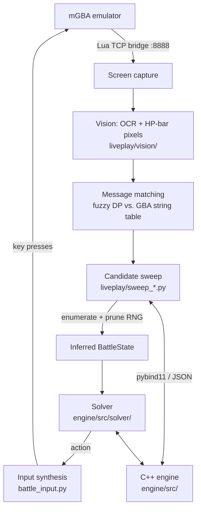

# NuzlockeAI

A battle engine and formal solver for **Pokémon Run & Bun**, a difficulty romhack of Pokémon
Emerald, built to be driven in real time by reading the emulator's screen.

> **Status: on hiatus.** Last worked on July 2026. The engine, the screen-reading inference layer,
> and two of three solvers are built and tested; the third was specified but never implemented. The
> live loop runs on an injectable policy — wiring certified solver output into it is still ahead.
> I expect to come back to it. See [Where I stopped](#where-i-stopped).

The interesting constraint here is not "play Pokémon well." It is that **being probably-right is
worthless**. A Nuzlocke run permanently loses any Pokémon that faints, so a line that wins 95% of
the time isn't a good line — it's a line that destroys the run one time in twenty. That pushes the
problem out of the space of policies that estimate and into the space of solvers that *prove*: the
goal is a certificate that a position is winnable against every choice the opponent AI can make
and every outcome the RNG can produce.

**This is close to the inverse of competitive Pokémon.** In PvP you have limited information about
your opponent, they adapt to you, both sides have access to every tool in the game, and the search
space is correspondingly enormous — but the bar is only to hold an edge. In a best-of-three you can
lose a third of your games and still come out ahead. In a Nuzlocke you know the opponent's exact
tools and decision distributions, and you can counter-pick a favourable matchup for every fight —
but your own roster is fixed and small, you can't spend a faint to pivot without burning a
permanent resource, and you need a win rate near 100%. PvP is the harder *search* problem under
genuine uncertainty; a Nuzlocke is far more tractable but held to a far stricter standard. Different
problem, not an easier one.

Three hard subproblems fall out of that:

1. **Owning the model.** A proof about the game is worthless if the model of the game is wrong,
   so the engine is a from-scratch reimplementation of the hack's mechanics *and* its opponent AI.
2. **Hidden state.** The only channel into the game is a 240×160 screen. Damage rolls, held items,
   ability triggers, and the opponent's reasoning are never displayed — they have to be inferred
   from HP-bar pixels and battle text.
3. **Certified search.** Proving a win means an AND-OR search where you choose and the RNG responds
   adversarially, over a space where the naive per-turn cost is a full battle simulation.

**Related repositories** — this is the third iteration of the idea, and the earlier two are
public because the reasons they were abandoned are the reasons this one is shaped the way it is:

- [NuzlockeSolver](https://github.com/Fracture17/NuzlockeSolver) — the original. Plays vanilla
  Emerald by reading GBA RAM directly, simulating with a patched Pokémon Showdown.
- [NuzlockeAI-v1](https://github.com/Fracture17/NuzlockeAI-v1) — the first version of this
  project: a Python engine with a learned value network. Archived.

---

## Architecture



**Vision.** Screen regions are read by strict pixel-template matching against the original
pokeemerald font bitmaps rather than general-purpose OCR — the font is known exactly, so template
matching is both faster and error-free where tesseract would guess. HP bars are read pixel by
pixel: the player's HP is an exact integer, the opponent's is only known to one of 48 pixel
buckets, so it is carried as an interval with explicit error bounds.

**Message matching.** Raw text passes through a stability filter (≥2 identical consecutive frames)
to reject mid-render frames, then fuzzy dynamic-programming matching against the game's string
table recovers which message fired.

### Why read the screen instead of memory?

The predecessor project read battle state straight out of GBA RAM — faster, exact, and far less
work. Reading pixels instead was deliberate:

- **The agent should play the way a person does.** Working from the same 240×160 screen a human
  sees is a constraint worth keeping rather than an obstacle to route around.
- **It's the constraint serious benchmarks use.** Game-playing competitions frequently require
  vision-only input, or score it above direct state access.
- **Correctness doesn't depend on it.** The candidate sweep is the oracle either way — if the
  inferred state contradicts the engine, the surviving candidate set goes empty and the run fails
  loudly. Vision changes how an observation arrives, not whether it can be checked.

There was a practical cost pushing the same way: Run & Bun has no decompilation, so memory
addresses have to be re-derived by hand. That is slow work for a coding agent, which gets no useful
feedback signal from an address hunt, so it needed far more of my direct involvement than the rest
of the project did.

**In hindsight I'd have done it anyway.** Reading memory would have given exact recorded battle
state, and therefore automated replay-based parity tests running in milliseconds — the same
technique that made the Python→C++ port verifiable. I didn't think of that at the time. It is the
single change that would most have accelerated this project.

**The candidate sweep.** The inference core. At each decision boundary it enumerates the cross
product of (player action × opponent action × crit × damage rolls × secondary effects), simulates
each, and discards every combination whose predicted HP deltas and message sequence contradict
what was observed. What survives is the set of world-states consistent with reality. If *nothing*
survives, that's a loud failure — the engine disagrees with the real game, and the discrepancy is
dumped for analysis rather than silently papered over.

**The engine.** ~21k lines of C++17 covering turn order, damage, abilities, items, status,
residuals, and the full Run & Bun opponent AI scorer. Exposed to Python via pybind11 with JSON at
the boundary.

---

## The solver

The solver answers one question: *given this 1v1 position, is there a player strategy that wins
against **every** opponent choice and **every** RNG outcome?* Verdicts are `WIN`, `LOSS`, or
`UNKNOWN`, and the two decisive answers must be **sound** — never merely likely.

### Making the graph cheap

The obstacle isn't the size of the state space; the search is lazy DFS, so only reachable states
are ever touched. The obstacle is that **every edge costs a full turn simulation** — resolving
order, damage, triggers, residuals, and the AI's decision.

So the solver compiles the simulation into a generic graph with arithmetic edges. The mechanism is
a **breakpoint set**: every HP value where behavior actually changes — item and ability triggers
(Sitrus at 1/2, pinch abilities at 1/3, Substitute's 1/4 cost), heal-cap kinks at `max_hp − c`,
hazard damage, faint at 0, and the AI's own regime boundaries (kill-estimate flips, score cap-ties,
Pursuit and Explosion and recovery thresholds). Breakpoints partition each HP axis into regions
on which **the turn's effect is a constant delta**.

`Expand` (`bucket/expand.cpp`) is the compiler. For each region it:

1. gates on support equality — both corners must induce the same AI action set,
2. calls the real simulator **exactly twice**, at the low and high endpoints, capturing the event
   path at one and replaying it at the other to prove they resolve identically,
3. asserts the shift property — image width equals input width, i.e. the map really is a constant
   translation,
4. splits the image at any breakpoint it crosses, interns the resulting discrete configs, and
   merges children that coincide.

After that the edge is a *number*. Traversing it costs a subtraction and a few bit flips instead
of a turn simulation, and a transition cache means a region reached again doesn't re-pay even the
two endpoint calls. This is also why heal caps are breakpoints: `min(h + c, max_hp)` is monotone
but is not a translation, so no single delta describes it.

Crucially, any mismatch at any of those gates **throws**. The design never auto-bisects, because a
self-healing search would silently mask an under-split region — and a region whose members don't
actually behave identically is exactly what turns a proof into a guess.

### Three solvers

| | Role | Guarantee |
|---|---|---|
| **A** — pessimistic collapse | LOSS-pruner. Worst-cases all RNG, enumerates no procs or accuracy | `LOSS` is sound; not-LOSS means nothing |
| **B** — `bucket_win_certify` | WIN-prover. AND-OR DFS: OR over your actions, AND over the opponent's full tied-best support, every RNG cell, and every miss branch | `WIN` is sound; not-`WIN` is *not* a loss |
| **C** — exact backprop solver | Definitive verdict | exact, modulo a documented concession list |

**"Exact modulo what?"** — worth being precise, because it's where the guarantee stops. Some
concessions are genuinely exact: paralysis, freeze and flinch can repeat forever under adversarial
RNG, so under probability-1 semantics a line that needs to act through them really is unwinnable.
Others are not: sleep lasts 1–3 turns and confusion is likewise bounded, so a line that stalls
through the gate and then wins genuinely exists — and gets conceded anyway, in exchange for speed.
Every conceded verdict carries a tag naming which gate caused it, so the cost is measurable rather
than invisible.

The gap between B and C is the interesting part. **B commits to a single action for an entire
region**, but a real player sees their exact HP and may want different actions at different HP
values inside that same region. So B's `NOT_WIN` genuinely means "unproven," not "lost."

C closes that gap by changing the return type: instead of one verdict per region it returns a
**partition** of the region's members into exact win and fail sets. It recurses into every
adversarial branch, takes each child's failure set, and pulls it *backward* through the turn map —
which, being a constant shift, inverts to an interval rather than a search — then intersects with
the reachable members to drop phantoms. Union the failure preimages across all branches, and
whatever survives wins by elimination. That recovers the HP-adaptive policy B cannot express.

### Two pipelines

- **Exact** — A → B → C. Definitive every time. The set that reaches C is precisely
  `{not proven-loss} ∩ {not proven-win}`.
- **Fast tri-valued** — A → B only, emitting `{WIN, LOSS, UNKNOWN}`. Cheap, because neither stage
  splits regions for policy. Designed for whole-game sweeps where `UNKNOWN` carries a heuristic
  verdict for resource allocation.

**A and B are implemented; C is specified but not yet written.** The `UNKNOWN` set the fast
pipeline produces currently has no consumer. Soundness of what exists is checked empirically by
`rcheck`, a referee that runs the fast pipeline against a slower exact certifier over generated
matchups and hard-fails on any contradiction.

---

## Verification

Correctness is the product here, so the test surface is larger than the feature surface.

| Gate | Scale | Catches |
|---|---|---|
| C++ self-regression manifest | 1,000,000 games (2,000 committed) | behavioral drift — seed → final state + fingerprint |
| Native unit tests (Catch2) | 425 cases, 141k assertions | engine and solver units |
| Python suite (pytest) | 1,779 tests across 97 files | sweep, vision, message matching, integration |
| Golden traces | 28 hand-authored scenarios | targeted mechanic edge cases via forced replay |
| Codegen staleness | `gen_cpp_data.py --check` | generated headers drifting from source tables |
| Solver referee | `rcheck` grid | solver soundness violations |

**What the manifest gate does and doesn't do.** It records a million deterministic self-play games
and stores each final state and fingerprint, so any change that alters behavior anywhere fails the
gate. But it only detects that behavior *changed* — it has no idea whether the change was correct.
Every intentional mechanic fix fails it too, and the fix then requires re-recording the affected
entries by hand. The safety property is not the gate; it's that the gate forces a human judgment
on every behavioral delta, and records the verdict. `RECORDS/` carries the resulting ledger of
deliberate divergences.

**On engine fidelity, three separate claims, deliberately not conflated:**

1. **Port fidelity** — the C++ engine was verified bit-identical to the Python reference
   implementation it was ported from, gate by gate. The build even sets `-ffp-contract=off`
   globally, because letting the compiler contract `a*b+c` into an FMA changes the last bit of the
   damage calculation, which changes a floor, which changes a KO, which diverges the whole game.
2. **Drift protection** — the manifest, as described above.
3. **Game fidelity** — established by mechanics research against the game's own behavior, Showdown's
   source, and the Run & Bun damage calculator. This is *not* bit-verified, and the known gaps are
   tracked explicitly in `RECORDS/INTENTIONAL_DIVERGENCES.md` and `RECORDS/*Issues.md`.

### Differential testing against the real game

The strongest evidence for game fidelity isn't a fixture suite — it's that the engine is
continuously given the chance to be contradicted by the game itself.

`SCRIPTS/stress_test.py` plays battles against the live emulator, running the full candidate sweep
after every turn. The sweep enumerates every RNG outcome the engine believes possible and discards
the ones contradicting the observed HP deltas and messages. **An empty surviving set means the
engine and the real game disagree**, and that halts the loop as a bug signal, with the boundary
recorded for offline replay.

What makes this sensitive rather than a formality:

- **Damage is a narrow window.** The roll is `pre_roll * (85 + roll_int) / 100` over 16 equiprobable
  outcomes, so a prediction spans ~15%. A 5% systematic error puts roughly a third of observations
  outside the predicted set; even a one-HP floor error contradicts on about one roll in sixteen.
- **Crits are doubly observable** — a disjoint damage range *and* their own message.
- **Player HP is read exactly**; opponent HP is bucketed into 48 pixels, which delays detection
  rather than preventing it.

### Support-set soundness

The solver needs the *set* of moves the opponent AI may choose, not the distribution over it —
proving a 100% outcome means beating every option, so relative score magnitudes within a tie are
irrelevant. That makes the two failure modes asymmetric:

| Error | Consequence |
|---|---|
| Support too **narrow** | The AI eventually picks an unmodelled move, the sweep finds no survivors, and live play **fails loudly** |
| Support too **wide** | Extra adversarial branches to beat, so some winnable positions can't be certified — costs completeness, never soundness |

**The dangerous direction is the detectable one.** An over-narrow support is what would make a
proof wrong, and it is precisely the case that announces itself during live play.

### What this doesn't cover

Support correctness has to hold at *every* state a proof touches. Stress testing visits a
distribution shaped by random play — broad and adversarial in its own way, but not the same
distribution a solver-driven line would reach, and the greedy policy that once supplied the other
20% was dropped in the migration. This argument is currently **unquantified**: there is no
instrumentation for distinct states visited or revisit counts, so the coverage claim rests on
volume rather than a measured figure.

**The design's own assumptions get audited too.** The solver's damage handling originally rested on
a claim in the formal spec: that a critical hit's minimum damage always exceeds a normal hit's
maximum by at least 1.275×, which would let all 32 damage outcomes for an attack collapse into a
single ordered range. Measured against a 1,500-matchup corpus, the claim was **false** — integer
floors put the real ratio nearer 1.25, so roughly 96% of standard moves violate it, and strict
dominance breaks down entirely at low damage, where a crit's minimum can equal a normal hit's
maximum.

It was replaced with the weaker property that does hold — crit-min ≥ noncrit-max, zero violations
across the corpus, with the fixed-damage move family allowlisted — and strict dominance was demoted
to a per-table fast path: one integer comparison at expansion time, used when true. It holds 99.92%
of the time, so almost no performance was lost, and a regression test now gates that fast-path
frequency at ≥90%, turning it into an early-warning signal for changes to the damage formula. An
assumption in a formal specification, empirically falsified, downgraded to a checked optimization
with a monitor on it.

---

## Current status

Development is paused, not abandoned — I stopped in July 2026 and expect to return to it. What
follows is where things actually stand.

**Working** — full singles engine with the R&B opponent AI; vision, message matching and the
candidate sweep running live against mGBA; solvers A and B with breakpoints, `Expand`, concede
detectors, transition caching and PP canonicalization; the regression suite above.

**Limitations**
- **Singles only.** Doubles is structurally gated (`active_indices=[0]`), with ~20 catalogued
  doubles defects in [TODO.md](TODO.md) — wrong-slot residual routing, shared speed-tie
  resolution, no AI target selection.
- **Solver C is unwritten**, so the `UNKNOWN` residue is undecided. This is the largest open
  piece, and it went unwritten because I stopped working on the project — not because of anything
  I learned about the approach. It was always scheduled as follow-on work after the prototype
  pipeline, and the design in `SOLVER_BUCKET_PLAN.md` still stands.
- **Solver B's win rate is limited by its concession list.** HP-dependent moves (Super Fang,
  Endeavor, Seismic Toss, Reversal) dominate by a wide margin: their maps are monotone but not
  constant shifts, so the interval collapse is invalid and the line is conceded.
- **The live loop is not solver-driven yet** — `SCRIPTS/play.py` runs an injectable policy.
- `run_candidate_sweep_cpp` is a stub; the sweep still runs in Python.
- Two `_apply_status_move` branches throw on unported effects; ~80 status moves are deliberately
  excluded; Pursuit switch-interception is unimplemented.

## Where I stopped

These are the next things I'd do, in order, whenever I pick it back up.

1. Solver C, to decide the `UNKNOWN` residue.
2. Special-case the HP-dependent moves to recover the conceded lines.
3. **Party selection and resource allocation** — extend the solver's question beyond a single 1v1
   to choosing a team and deciding which finite consumables to spend, which requires sweeping
   every remaining battle cheaply to get a value estimate. This is what the fast tri-valued
   pipeline was designed to feed.
4. Wire certified lines into the live-play policy.
5. Lift the doubles gate.

---

## Repository layout

| Path | Contents |
|---|---|
| `engine/src/` | C++ engine — turn resolution, damage, effects, residuals, AI scorer |
| `engine/src/solver/` | Transition oracle, bucket solver, analytic certifier, audit tools |
| `engine/bindings/` | pybind11 module (`nuzlocke_engine_cpp`) |
| `engine/tests/` | Catch2 native tests |
| `liveplay/` | Python: vision, message matching, candidate sweep, state, emulator I/O |
| `tests/` | pytest suite and fixtures |
| `SCRIPTS/` | Build, codegen, live-play, stress-test and solver-gate tooling |
| `RECORDS/` | Mechanics research, known divergences, design decisions |
| `.claude/` | The LLM agent workflow used to build this — see its README |

## Building

Requires a C++17 compiler, CMake ≥ 3.15, and Python 3.14.

```bash
python3 -m venv .venv
.venv/bin/pip install -r requirements.txt
.venv/bin/python SCRIPTS/build_cpp.py      # builds and installs the .so into the venv
```

```bash
.venv/bin/python -m pytest                          # Python suite
cmake --build engine/build --target nuzlocke_native_tests
ctest --test-dir engine/build                       # native suite
```

## Game data

Contains **no ROM and no savestates.** Running live requires your own legally-obtained copy of
Pokémon Emerald and the Run & Bun patch, plus your own savestates — create them with
`SCRIPTS/play.py` (`M` key), which writes into a git-ignored `States/`.

The static data tables under `liveplay/data/` (base stats, move power and accuracy, type chart,
learnsets) *are* included, since the project cannot build without them and the same information is
published openly by PokéAPI, Bulbapedia, and Pokémon Showdown. The generated headers in
`engine/generated/` derive from those tables via `SCRIPTS/gen_cpp_data.py`.

## License

MIT — see [LICENSE](LICENSE).
